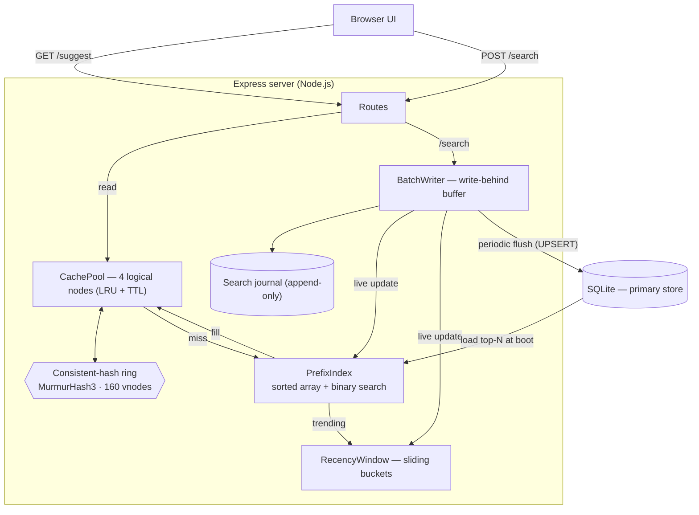

# Architecture

This document explains how QuickSuggest is built and **why** each choice was made —
the data model, the suggestion path, the distributed cache and consistent hashing,
the trending algorithm, and the batched write path — plus the trade-offs of each.

## 1. The big picture



Two principles drive the design:

1. **Reads stay in memory.** A suggestion request touches only the cache and the
   in-memory prefix index — never SQLite. That is what makes p99 latency sub-millisecond.
2. **Writes are decoupled from requests.** A search updates in-memory state instantly
   (so suggestions are fresh) and is persisted later in batches, so the database is
   never on the hot path.

## 2. Request flows

### `GET /suggest?q=<prefix>&mode=`

```
normalize(q) ──► cache.get(prefix, mode)
                     │ hit  ──► return cached suggestions          (~0.1 ms)
                     │ miss ──► rank:
                     │           popular  -> prefix index top-K by count
                     │           trending -> pool + recency window, re-scored
                     │         cache.set(prefix, mode, result)
                     └──► return { prefix, mode, source, node, latencyMs, suggestions }
```

### `POST /search`

```
normalize(query) ──► journal.append(query)          // durability first
                 ──► buffer[query] += 1              // write-behind aggregation
                 ──► prefixIndex.bump(query, +1)     // live: suggestions stay fresh
                 ──► recencyWindow.record(query)     // live: trending stays fresh
                 ──► if buffer is full -> flush()
                 ──► return { "message": "Searched" }
```

A background timer also flushes every `FLUSH_INTERVAL_MS`. A flush writes one additive
`UPSERT` per distinct query in a single transaction, invalidates the affected cached
prefixes, and truncates the journal.

## 3. Primary store — SQLite

```sql
CREATE TABLE queries (
  query      TEXT    PRIMARY KEY,
  count      INTEGER NOT NULL DEFAULT 0,   -- ranking weight: dataset count + accepted searches
  searches   INTEGER NOT NULL DEFAULT 0,   -- times submitted via /search
  updated_at INTEGER NOT NULL DEFAULT 0
);
CREATE INDEX idx_queries_count ON queries(count DESC);
```

**Why SQLite.** The assignment needs *durable, reliable* counts and an *easy local
run* — not horizontal scale. SQLite is ACID, embedded (one file, zero ops), and with
`journal_mode = WAL` handles our write-batch + occasional read pattern comfortably.
Because reads are served from memory, the store is never the read bottleneck, so a
heavier client/server database would add operational cost for no latency benefit.

**Durability.** `synchronous = NORMAL` + WAL is the standard "fast but safe on app
crash" setting. (SQLite's WAL is separate from our application-level search journal in
§7 — the former protects committed rows, the latter protects searches not yet committed.)

## 4. Suggestion data structure — sorted array, not a trie

All loaded queries live in one array sorted lexicographically by query string. Every
query that starts with a prefix forms a **contiguous slice**, located by binary search.

```
entries  : [{ q, c }] sorted by q       e.g. ["data","data and","data structures", ...]
byQuery  : Map q -> entry ref            O(1) count updates
short    : Map prefix(<=3) -> top-K refs maintained incrementally, hot prefixes
```

**Lookup.**
- **Prefix length ≤ 3** (configurable `PRECOMPUTE_LEN`): served from the maintained
  `short` bucket in `O(1)`. This avoids rescanning the enormous slice behind a hot
  prefix like `"a"` on every miss.
- **Longer prefixes:** binary-search the lower bound, scan the (now small) slice while
  it still starts with the prefix, and partial-sort the top-K by count.

**Live updates.** `bump(query, +1)` updates the count in `O(log n)` (or inserts a new
query) and repairs only that query's short buckets in `O(precomputeLen · K)`. So a
search is reflected in suggestions immediately, with no rebuild.

**Complexity & trade-off.**

| Operation | Cost |
|---|---|
| Lookup, short prefix | `O(K)` (precomputed) |
| Lookup, long prefix | `O(slice + slice·log K)` — slice is small |
| Count update (existing query) | `O(log n)` |
| New query insert | `O(n)` array splice — **rare** vs repeated searches |

A trie gives `O(prefix length)` traversal but costs far more memory (a node per
character, pointer-heavy) and still needs per-node top-K bookkeeping. The sorted array
is cache-friendly, compact, and trivially range-scannable. The one weakness — `O(n)`
insertion of a *brand-new* query — is acceptable because the overwhelming majority of
searches are repeats of queries already in the corpus; new queries could be staged and
merged in batches if write-mix changed.

## 5. Distributed cache + consistent hashing

### Logical cache nodes
The cache is a **pool of `CACHE_NODES` logical nodes**. Each node is an LRU map
(insertion-ordered `Map` → re-insert on hit, evict the oldest over capacity) with a
**per-entry TTL**. The assignment explicitly allows "logical cache nodes"; these
exercise the same distribution, routing and invalidation semantics as separate cache
servers, with nothing to install. Each node hides behind a tiny `get/set/delete`
interface, so a node could be replaced by a real Redis/memcached process without
touching anything above it.

### The ring
Keys are `"<mode>:<prefix>"`. Each logical node is hashed onto a ring at
`CACHE_REPLICAS` (160) positions — its **virtual nodes**. A key is owned by the first
ring point clockwise from `hash(key)`, found by binary search; the ring wraps at the top.

```
hash = MurmurHash3-32           // strong avalanche even for "cache-0#vn0", "cache-0#vn1"
points = sorted [{ hash, node }] // 4 nodes x 160 vnodes = 640 points
getNode(key) = points[ firstIndexWithHash >= hash(key) ].node   // wrap to 0
```

**Why virtual nodes.** With one point per node the arcs are wildly uneven; 160 vnodes
per node smooths the arc lengths so each node owns ≈ an equal share. Measured over
10k distinct keys: **24.5%–25.8%** per node (ideal 25%).

**Why MurmurHash3 (not `hash % N`, not a weak hash).** `hash % N` re-homes almost every
key whenever `N` changes — fatal for a cache. Consistent hashing re-homes only the keys
on the changed node's arcs: **adding a 5th node moved ≈ 21% of keys (ideal `1/5`)**,
versus ~75% for `% N`. MurmurHash3's strong bit-avalanche is what keeps the *vnode
positions* (which come from near-identical strings) well spread; a weaker hash clusters
them and unbalances the ring.

`GET /cache/debug?prefix=…` shows the owner node, key hash, ring slot, and hit/miss for
any prefix; `GET /cache/distribution` shows the live balance across nodes.

### Expiry **and** invalidation
- **TTL** (`CACHE_TTL_MS`, 30 s; trending 5 s) with **±15% jitter** so entries don't all
  expire together (no thundering herd). This is the safety net for staleness.
- **Targeted invalidation:** when a flush changes counts, the affected prefixes (every
  prefix of each updated query, up to `INVALIDATE_MAX_LEN`) are deleted from the cache in
  both modes. So suggestions reflect new counts within one flush window, not one TTL.

## 6. Trending — recency-aware ranking

The assignment asks five specific questions; here they are, answered directly.

**(1) How recent searches are tracked.** A `RecencyWindow` slices time into
`WINDOW_BUCKETS` buckets of `BUCKET_MS` each (default **60 × 10 s = a 10-minute window**)
held in a ring. Each `record(query)` increments the current bucket and a rolling
aggregate `agg[query]`. When time advances, buckets that scrolled off the back are
cleared and subtracted from `agg`. So `recentCount(query)` and `top(n)` are `O(1)` /
`O(active)` — no per-read decay loop.

**(2) How recent activity affects ranking.** In `mode=trending` the score is

```
score(q) = log1p(count(q)) + RECENCY_WEIGHT · recentCount(q)
```

The all-time term is squashed by `log1p` so it cannot dwarf everything; that headroom
lets a burst of recent searches lift a query. Candidates are the prefix's popular pool
**unioned with** any query currently active in the window that matches the prefix — so a
freshly trending query that is *not* historically popular still surfaces.

> Live example: for prefix `data`, popular mode ranks `data` (count 406M) first. After a
> few searches of `data structures` (count ≈ 1M), trending mode scores it
> `log1p(1e6) + 2.5·6 ≈ 28.8` vs `data`'s `≈ 19.8`, so **`data structures` jumps to #1.**

**(3) How short-lived spikes are not over-ranked forever.** Because the window *slides*,
a spike's contribution is removed as soon as its buckets age past the window edge — its
boost decays to zero automatically with no special "cool-down" logic. An all-time query
with no recent traffic falls back to its `log1p(count)` baseline.

**(4) How the cache is kept consistent when rankings change.** Trending entries use a
short TTL (5 s) and are dropped by the same targeted invalidation that runs on every
flush, so a changed ranking is reflected quickly. Popular and trending results are cached
under separate keys (`popular:…` / `trending:…`) so they never collide.

**(5) Trade-offs (freshness vs latency vs complexity).** The window buckets cost a little
memory proportional to the number of *distinct* recently-searched queries (small). The
rolling aggregate keeps trending reads cheap. Bucket granularity is the freshness/latency
knob: more, smaller buckets = finer recency at slightly more bookkeeping. Compared with
continuous exponential decay, a sliding window is simpler to reason about and makes the
"don't over-rank a spike" guarantee structural rather than parameter-tuned, at the cost
of coarser time resolution within a bucket.

## 7. Batch writes — write-behind buffer + journal

**Buffer & aggregation.** Each `/search` increments `buffer[query]`. Repeated queries
within a window collapse into a single entry, so N searches of the same query become one
row write carrying `+N`.

**Flush triggers.** A flush fires when the buffer reaches `FLUSH_BATCH_SIZE` (200 distinct
queries) **or** every `FLUSH_INTERVAL_MS` (2 s), whichever comes first.

**Additive, conflict-free persistence.** A flush runs one transaction of prepared upserts:

```sql
INSERT INTO queries (query, count, searches, updated_at) VALUES (@q, @inc, @inc, @ts)
ON CONFLICT(query) DO UPDATE SET
  count    = count + excluded.count,     -- ACCUMULATE, never overwrite
  searches = searches + excluded.searches,
  updated_at = excluded.updated_at;
```

Because counts accumulate, the order flushes run in never matters — two flushes touching
the same query can't clobber each other.

**Why this reduces writes.** Instead of one transaction per search, we do one transaction
per flush. Measured on a concentrated workload, 20,000 searches became **4,721 rows in 5
transactions ≈ 4.2× fewer rows and 4000× fewer transactions**. The transaction reduction
is the dominant, always-true win (far fewer fsyncs / round-trips); the row reduction scales
with how repetitive the traffic is.

**Failure trade-off (crash before a flush).** A pure in-memory buffer would lose its
contents on a crash. QuickSuggest adds an **append-only journal**
(`data/search-journal.log`): every accepted search is appended *before* it is buffered, so
on the next start the un-flushed tail is **replayed** and persisted (`recoveredFromJournal`
in `/stats` reports how many). Because flushing is fully synchronous, a successful flush
simply truncates the journal. This bounds worst-case loss from "a whole flush window" to
"only searches the OS had not yet flushed to disk." `fsync`-per-append would close that
last gap at a throughput cost; for approximate popularity counts the current setting is the
right balance. The journal can be disabled with `JOURNAL_ENABLED=false`.

## 8. Consistency / freshness model

- **Suggestions** reflect a search *immediately* (the index and recency window are updated
  on submit), independent of when the row reaches SQLite.
- **SQLite** lags by at most one flush window (≤ 2 s, or ≤ `FLUSH_BATCH_SIZE` distinct
  queries) — eventual consistency for the durable store.
- **Cache** can be stale for at most one TTL, and usually far less because of targeted
  invalidation on flush.

This is a deliberate availability/latency-first posture: reads are always fast and never
block on writes, and the only thing that lags is the durable store, by a bounded amount.

## 9. Known limits & possible extensions

- **Single process.** The index and cache live in one Node process. Horizontal scale would
  shard the corpus by prefix range and promote the logical cache nodes to real cache
  servers (the ring already abstracts placement).
- **New-query insertion is `O(n)`** (array splice); a staging buffer + periodic merge would
  amortise this if the write mix became new-query-heavy.
- **Recency is process-local**, so trending resets on restart; persisting bucket counters or
  moving them to a shared store would survive restarts.
- **Counts are approximate** under crash (bounded by the journal). For exact accounting,
  `fsync` each journaled search or write through synchronously.
