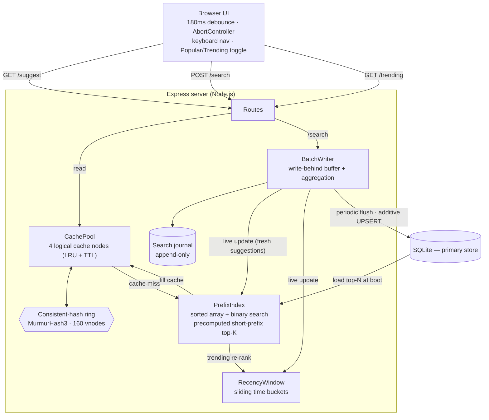

# QuickSuggest — Search Typeahead System

A low-latency search **typeahead / autocomplete** service: it suggests popular
queries as you type, records submitted searches, and keeps suggestions fast with
a **distributed cache addressed by consistent hashing**. It also supports
**recency-aware "trending" ranking** and **batched (write-behind) persistence**
so the database isn't hit on every keystroke or every search.

Built with **Node.js + Express** and an embedded **SQLite** store — no Docker, no
Redis, no Postgres. Clone, install, load a dataset, and run.

```
type "data"  ──►  data structures · data structure · data stream · ...   (≈0.1 ms, cache hit)
press Enter  ──►  { "message": "Searched" }  + the query climbs trending
```

---

## Contents

- [Features](#features)
- [Architecture at a glance](#architecture-at-a-glance)
- [Quick start](#quick-start)
- [Dataset](#dataset)
- [API documentation](#api-documentation)
- [How it works](#how-it-works)
- [Configuration](#configuration)
- [Testing](#testing)
- [Performance](#performance)
- [Project structure](#project-structure)
- [Design choices & trade-offs](#design-choices--trade-offs)

---

## Features

| Requirement | How QuickSuggest does it |
|---|---|
| Typeahead suggestions (top 10, prefix match, sorted by count) | In-memory **sorted-array prefix index** with binary search + precomputed short-prefix top-K |
| Graceful empty / missing / mixed-case / no-match input | Input normalised (lowercase, whitespace-collapsed); empty → `[]`, no-match → `[]`, never errors |
| Debounced UI, keyboard navigation | 180 ms debounce + `AbortController` (cancels stale requests), ↑/↓/Enter/Esc |
| Search submission + dummy response | `POST /search` → `{ "message": "Searched" }`, count updated |
| Low-latency reads via caching | **Distributed cache** in front of the index; reads never touch SQLite |
| Distributed cache + **consistent hashing** | Pool of logical cache nodes on a **MurmurHash3 ring** with 160 virtual nodes |
| Cache expiry / invalidation | Per-entry TTL (with jitter) **and** targeted invalidation on flush |
| Trending searches | **Sliding time-window** recency tracker + recency-aware re-ranking |
| Batch writes | **Write-behind buffer** with aggregation + size/time flush + crash-recovery journal |
| Performance reporting | `npm run benchmark` → p50/p95/p99 latency, cache hit rate, write reduction, ring balance |

---

## Architecture at a glance



The **read path** (`/suggest`) checks the distributed cache first; on a miss it
computes suggestions from the in-memory prefix index (and the recency window for
trending mode), then fills the cache. **The SQLite store is never read on the
suggestion path.** The **write path** (`/search`) appends to a durability journal,
updates the in-memory structures immediately (so suggestions stay fresh), and lets
the write-behind buffer fold counts into SQLite in periodic batches.

A deeper write-up with sequence flows and rationale is in
[ARCHITECTURE.md](ARCHITECTURE.md).

---

## Screenshots

The landing page with the live trending panel:


The same `/suggest` endpoint, two ranking modes:

| Popular (all-time count) | Trending (recency-aware) |
|---|---|
|  |  |

In **Popular** mode `data` (406M all-time count) leads. In **Trending** mode, after a
handful of recent searches, `data structures` (+7 recent) and `database design` (+3 recent)
leapfrog it — the `+N recent` chips show exactly why.

---

## Quick start

**Prerequisites:** Node.js ≥ 18 (developed on Node 22). That's it — no Docker, no
database server.

```bash
# 1. install dependencies
npm install

# 2. fetch the dataset (~10 MB, downloads two open n-gram files)
npm run fetch-data

# 3. load it into SQLite (parses ~600k queries, takes a few seconds)
npm run load-data

# 4. run
npm start
# -> open http://localhost:3000
```

No internet access? Skip steps 2–3 and use the offline synthetic generator:

```bash
npm run load-data -- --synthetic 150000
npm start
```

---

## Dataset

QuickSuggest uses the open **Norvig word-frequency n-gram lists** (derived from the
Google Web Trillion Word Corpus), which are already in `query<TAB>count` form:

| File | Source | Rows | Example line |
|---|---|---|---|
| `count_1w.txt` | <https://norvig.com/ngrams/count_1w.txt> | ~333k single words | `the\t23135851162` |
| `count_2w.txt` | <https://norvig.com/ngrams/count_2w.txt> | ~286k two-word phrases | `of the\t2766332391` |

Combined that is **~590k unique queries** with real popularity counts — well above
the 100k minimum, and the bigrams give realistic multi-word queries (`data structures`,
`how to`, `new york`, …).

`npm run load-data` options:

```bash
npm run load-data                      # load count_1w + count_2w
npm run load-data -- --reset           # wipe the table first
npm run load-data -- --unigrams-only   # single words only
npm run load-data -- --limit 200000    # keep only the top-N by count
npm run load-data -- --min-count 50    # drop rare terms
npm run load-data -- --synthetic 150000  # offline, no files needed
```

At boot the server loads the **top `LOAD_LIMIT` (default 300,000)** queries by count
into the in-memory index.

---

## API documentation

Base URL: `http://localhost:3000`

### `GET /suggest?q=<prefix>&mode=popular|trending`
Up to 10 prefix-matching suggestions, sorted by the chosen ranking.

```bash
curl 'http://localhost:3000/suggest?q=java'
```
```json
{
  "prefix": "java", "mode": "popular", "source": "index", "node": "cache-1", "latencyMs": 0.14,
  "suggestions": [
    { "query": "java", "count": 55360151 },
    { "query": "javascript", "count": 25766226 },
    { "query": "java games", "count": 1391517 }
  ]
}
```
- `mode=popular` (default) — sort by all-time count.
- `mode=trending` — recency-aware ranking; each item also returns `recent` and `score`.
- `source` is `cache` (hit), `index` (computed then cached), or `empty`.

### `POST /search`
Record a submitted search and return the dummy response.

```bash
curl -X POST http://localhost:3000/search -H 'Content-Type: application/json' -d '{"query":"data structures"}'
```
```json
{ "message": "Searched" }
```

### `GET /trending?n=10`
Top queries in the current sliding window.

```json
{ "windowMs": 600000, "activeQueries": 1, "trending": [ { "query": "data structures", "recent": 6, "count": 998617 } ] }
```

### `GET /cache/debug?prefix=<prefix>&mode=popular|trending`
Which cache node owns a prefix key, and whether it is currently a hit or miss.

```json
{ "prefix": "da", "mode": "popular", "cacheKey": "popular:da", "keyHash": 3932078230,
  "ownerNode": "cache-3", "ringSlotHash": 3935099281, "status": "miss", "ttlRemainingMs": null }
```

### `GET /cache/distribution?samples=N`
How a sample of keys spreads across the cache nodes (consistent-hashing balance).

```json
{ "nodes": ["cache-0","cache-1","cache-2","cache-3"], "replicasPerNode": 160, "samples": 5000,
  "percent": { "cache-0": 25.8, "cache-1": 24.5, "cache-2": 24.8, "cache-3": 24.9 }, "idealPercent": 25 }
```

### `GET /stats`
Latency percentiles, cache hit rate, DB read/write counters, write-reduction factor, buffer depth.

### `GET /health`
Liveness + indexed query count + pending writes.

---

## How it works

Short version here; full detail and trade-offs in [ARCHITECTURE.md](ARCHITECTURE.md).

- **Prefix index** — all queries live in one lexicographically **sorted array**;
  every query with a given prefix is a contiguous slice found by **binary search**.
  Short, hot prefixes (≤ 3 chars) keep an incrementally-maintained top-K bucket so
  we never rescan a huge slice. Reads are served from memory; SQLite is never read.
- **Distributed cache + consistent hashing** — `mode:prefix` keys are routed by a
  **MurmurHash3 ring with 160 virtual nodes per logical node**, so load is even and
  adding/removing a node only re-homes ~`1/(N±1)` of keys (not everything, as
  `hash % N` would). Each node is an **LRU map with per-entry TTL** (+ jitter), plus
  **targeted invalidation** when a flush changes counts.
- **Trending** — a **sliding window of time buckets** tracks recent hits; the
  trending score is `log1p(count) + weight · recentCount`. Because the window slides,
  a short-lived spike ages out on its own — it can't be over-ranked forever.
- **Batch writes** — searches go into a **write-behind buffer** that aggregates
  repeats and flushes every 2 s or every 200 distinct queries in a single additive
  `UPSERT`. An **append-only journal** records each search first, so a crash before a
  flush is recovered by replay on the next start.

---

## Configuration

All settings have sensible defaults and can be overridden via environment variables
or a `.env` file (see [`.env.example`](.env.example)). Highlights:

| Variable | Default | Meaning |
|---|---|---|
| `PORT` | `3000` | HTTP port |
| `LOAD_LIMIT` | `300000` | top-N queries loaded into memory at boot |
| `CACHE_NODES` | `4` | logical cache nodes |
| `CACHE_REPLICAS` | `160` | virtual nodes per node on the ring |
| `CACHE_TTL_MS` | `30000` | suggestion cache TTL |
| `FLUSH_INTERVAL_MS` | `2000` | write-behind flush interval |
| `FLUSH_BATCH_SIZE` | `200` | flush after this many distinct queries |
| `WINDOW_BUCKETS` / `BUCKET_MS` | `60` / `10000` | 10-minute sliding window |
| `RECENCY_WEIGHT` | `2.5` | weight of the recency term in trending |

---

## Testing

```bash
npm test
```

25 unit tests (Node's built-in runner, no extra dependency) cover the hash ring
(balance + re-map cost), prefix index (matching, ordering, live updates, new
queries), cache (TTL, LRU, routing, invalidation), recency window (windowing +
age-out), ranking (popular vs trending), and the batch writer (aggregation, flush
triggers, **journal crash-recovery**).

---

## Performance

Measured in-process with `npm run benchmark` on the ~590k-query dataset (300k loaded):

| Metric | Result |
|---|---|
| Suggestion latency (popular) | **p50 ≈ 0.002 ms, p95 ≈ 0.08 ms, p99 ≈ 0.26 ms** |
| Cache hit rate (steady state) | **≈ 81%** |
| DB reads on the suggestion path | **0** |
| Batch write reduction | **≈ 4.2× rows, 4000× transactions** |
| Cache distribution (4 nodes) | **24.5% – 25.8%** (ideal 25%) |
| Keys re-homed when adding a 5th node | **≈ 21%** (ideal 20%) |

Full report (regenerated on each run): [PERFORMANCE.md](PERFORMANCE.md).

```bash
npm run benchmark -- --reads 20000 --writes 20000
```

---

## Project structure

```
quicksuggest/
├── src/
│   ├── server.js          # boot: open DB, build index, wire cache/recency/batch, listen
│   ├── config.js          # env-driven config (+ tiny .env reader, no dependency)
│   ├── routes.js          # all HTTP endpoints
│   ├── database.js        # SQLite store: schema, bulk load, additive batch upsert
│   ├── prefixIndex.js     # sorted-array prefix index + precomputed short-prefix top-K
│   ├── hashRing.js        # MurmurHash3 + consistent-hash ring with virtual nodes
│   ├── cachePool.js       # logical cache nodes (LRU + TTL) routed by the ring
│   ├── recencyWindow.js   # sliding-window recency tracker (trending)
│   ├── scoring.js         # popular vs recency-aware ranking
│   ├── batchWriter.js     # write-behind buffer + append-only journal
│   └── stats.js           # counters + latency percentiles
├── public/                # frontend: index.html, styles.css, app.js (no build step)
├── scripts/
│   ├── fetch-dataset.js   # download the Norvig n-gram files
│   ├── load-dataset.js    # ingest into SQLite (or generate synthetic)
│   └── benchmark.js       # performance harness -> PERFORMANCE.md
├── test/                  # node:test unit tests
├── ARCHITECTURE.md
├── PERFORMANCE.md
└── README.md
```

---

## Design choices & trade-offs

Brief summary — see [ARCHITECTURE.md](ARCHITECTURE.md) for the full reasoning.

- **SQLite over a separate DB server** — the assignment needs durable counts and an
  easy local run, not horizontal scale. SQLite gives ACID + zero ops. Reads never
  touch it, so it is never the latency bottleneck.
- **Sorted array over a trie** — comparable lookup speed for top-K-by-count, far less
  memory and pointer overhead, and trivial to range-scan; the cost is `O(n)` insertion
  of a brand-new query (rare vs repeated searches).
- **In-process logical cache nodes over real Redis** — they exercise the exact same
  routing/invalidation semantics consistent hashing requires, with nothing to install.
  Each node sits behind a small interface and could be swapped for a Redis process.
- **Sliding window over exponential decay** for trending — a window makes "a spike must
  not be over-ranked forever" automatic (it leaves the window), and needs no per-read
  decay math.
- **Write-behind batching + journal** — trades a tiny, bounded staleness for a large
  drop in writes; the journal bounds crash loss to un-fsynced searches rather than a
  whole flush window.
